# Modern Graphics Library (with SDL) Installation Guide on C on Windows

## Steps

### Downloads

- Download mingw compiler from: https://winlibs.com/ (also includes clang and others)
  - preferably latest one and 64bit for modern systems

  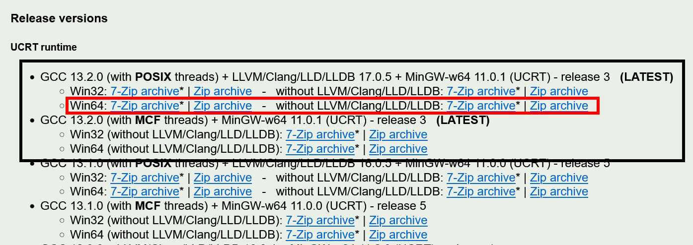

  - info on compiler is explained in this page too 😊

- Download SDL (Simple Directmedia Layer) from: https://www.libsdl.org/

  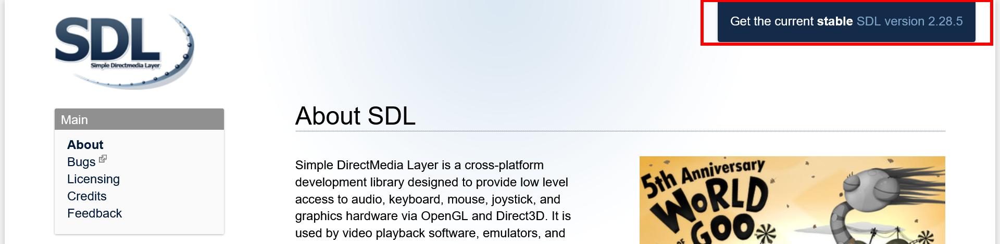

  - it will direct you to their github page, download <strong>SDL2-devel-2.28.5-mingw.zip</strong> (since we are using windows with mingw compiler) 

  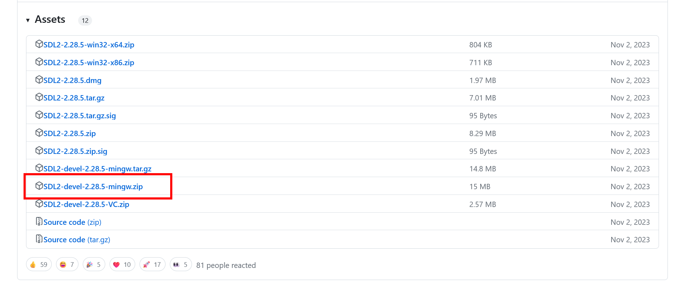

  - info on what SDL is and all, is provided in their own documentations

- Download SDL_bgi from: https://sdl-bgi.sourceforge.io/
  - this project brings functionality of above SDL libraries with BGI (Borland Graphics Interface) on modern systems

  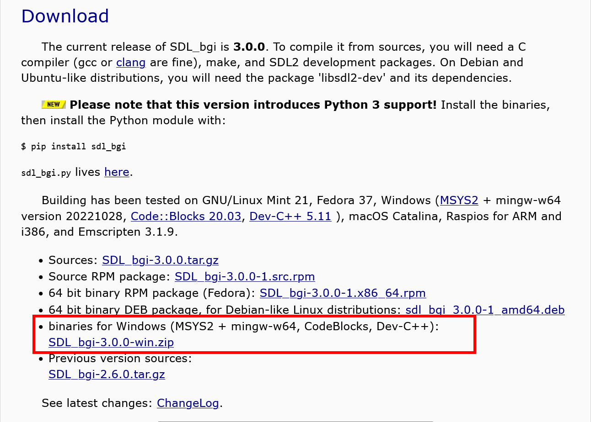

  - download binaries for windows (since we are on windows and using mingw compiler)
  - it will open their sourceforge page and begins downloading automatically

### Installations

- when you download all files it will be like this in your <strong>default</strong> Downloads folder (for me, it's regular ol' downloads folder)

  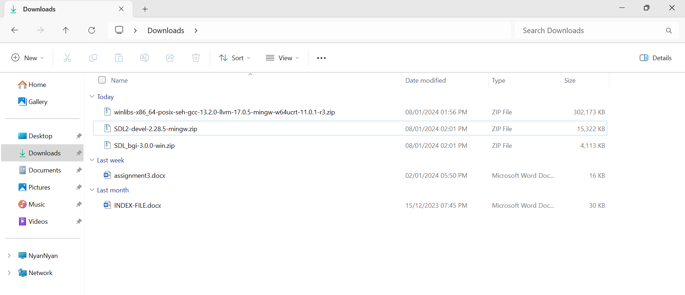

- extract <strong>mingw64</strong> from file named: <strong>winlibs-x86_64-posix-seh-gcc-13.2.0-llvm-17.0.5-mingw-w64ucrt-11.0.1-r3.zip</strong>

  - (I am using <strong>Nanazip</strong> to extract file. You can freely use your own preferred file manager of your choice 😊)

  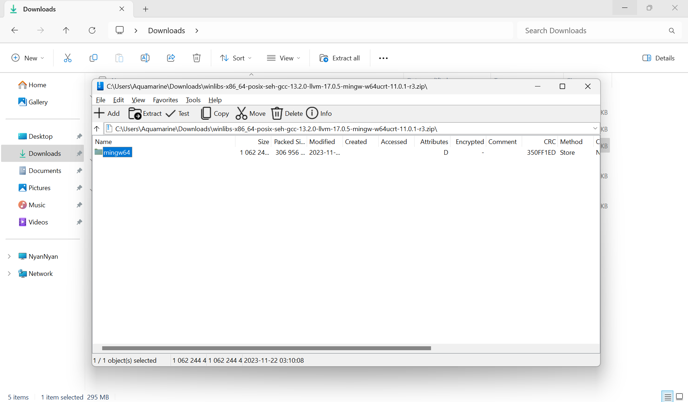

  - extract preferably on location such as "<strong>C:\mingw</strong>"

  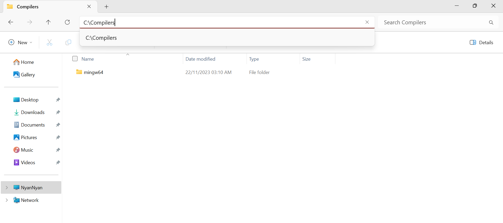

  - in my case it's inside "<strong>Compilers</strong>" folder inside of "<strong>C:</strong>" drive, so it is "<strong>C:\Compilers\mingw64</strong>"

- extract <strong>all</strong> folders from inside of <strong>SDL2-devel-2.28.5-mingw.zip => SLD2-2.28.5 => x86_64-w64-mingw32</strong> folders to <strong>C: => mingw64</strong>

  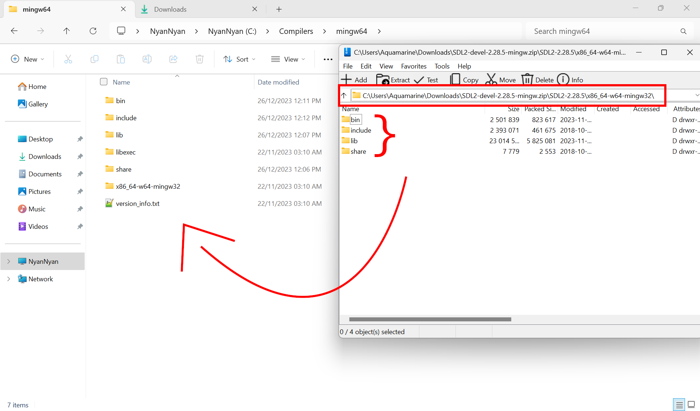
  - this should copy SDL files inside <strong>mingw64</strong> folder or wherever you extracted that folder to

- extract "<strong>SDL_bgi.dll</strong>" file  inside of <strong>SDL_bgi-3.0.0 => bin => Mingw64</strong> to <strong>C: => ming64 => bin</strong> directory or inside <strong>bin</strong> folder of wherever you extracted <strong>ming64</strong> to

  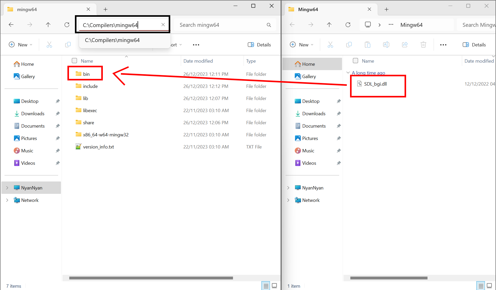

- extract/copy "SDL_bgi.h" file from inside of "<strong>SDL_bgi-3.0.0 => src</strong>" to "<strong>C: => mingw64 => include => SDL2</strong>"

  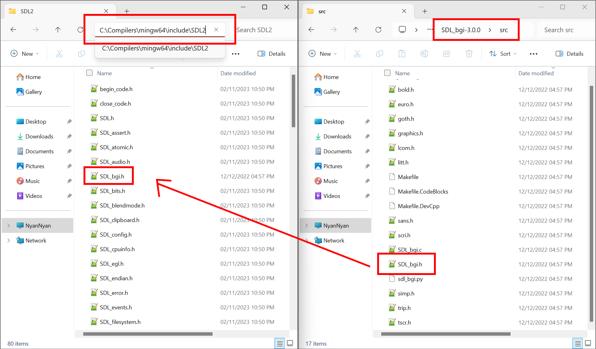

- similarly, copy "<strong>graphics.h</strong>" from same folder (SDL_bgi-3.0.0\src) to now in include folder (mingw64/include)

  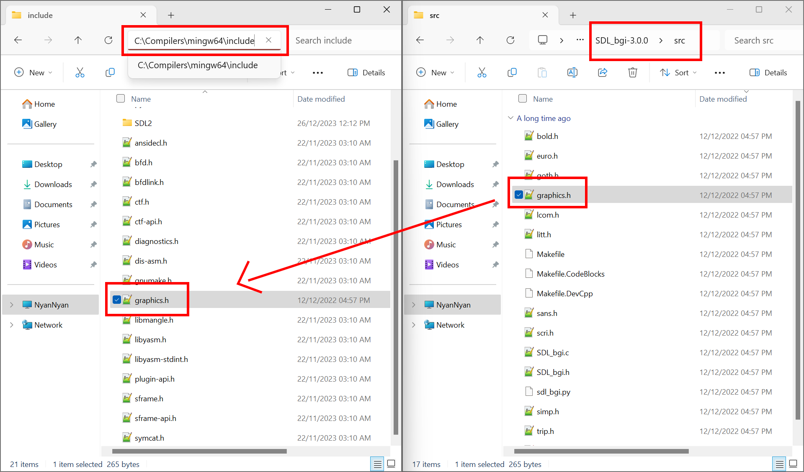

If you followed these instructions, Congrats 👏! All necessary files have been properly installed. But, we still need to configure it so that the compiler knows which libraries are where and link it.

### Configuration

For this I am using VS Code (-- which is the best text editor - for me atleast, pls don't kill me ( •̀ ω •́ )✧ --), you can use whatever text editor you want but I only know how to configure it in vs code. For others, PLEASE check there own documentations.

#### In Windows

- First, lets direct windows to know the location of ming64 compiler
- search for "<strong>Edit System Environment</strong>"

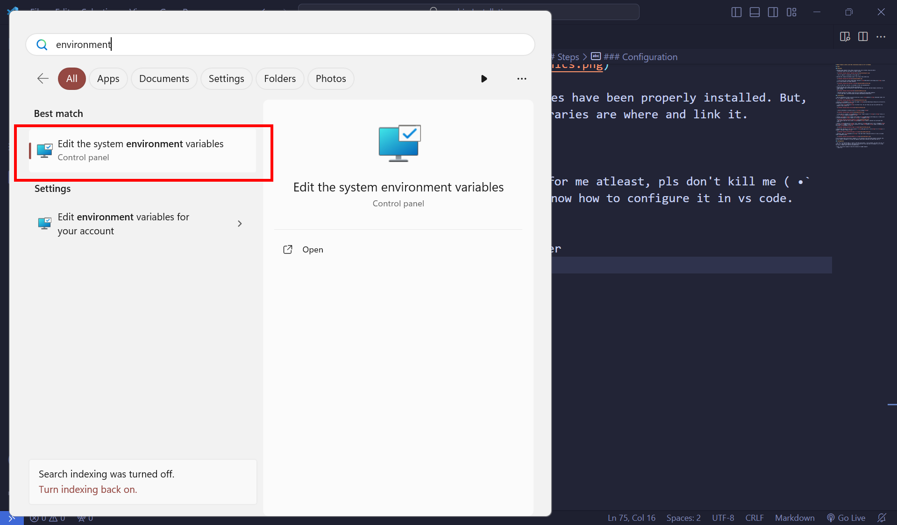

- click on it, it will give uac (user account control) promt, click on "Yes"
- click "<strong>Environment Variables</strong>"
  
  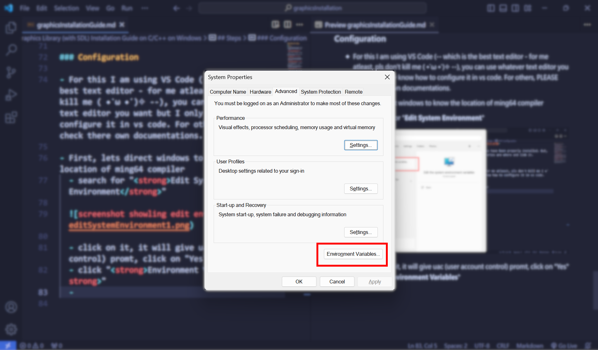

- "Environment Variables" window should pop up, double click 👆👆 on "path" to open another window "<strong>Edit environment variable</strong>"
- click on "New" or on blank space
- simply copy the "<strong>bin</strong>" path from where you have extracted ming64 to. For me it will be "C:\Compilers\mingw64\bin". For you it may be smth like "<strong>C:\ming64\bin</strong>" and paste it in that blank space !!!

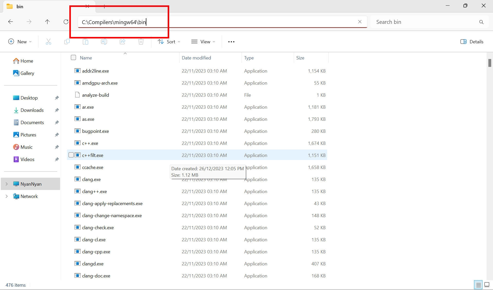
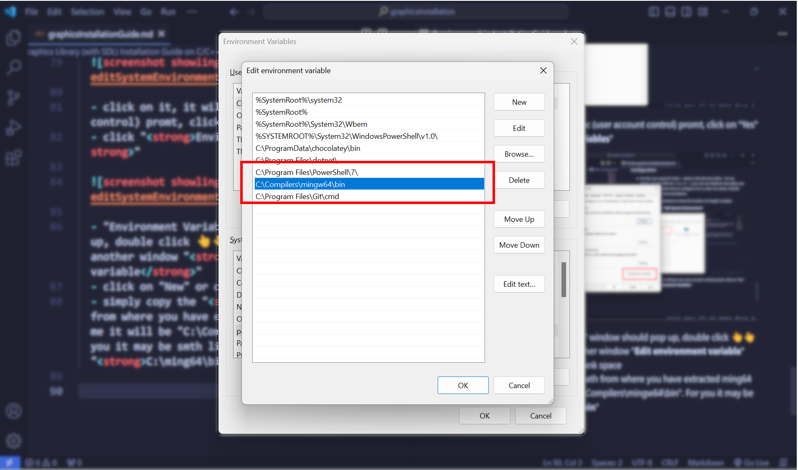

- now click ok, ok and finally... ok 👆👆👆

#### In VS Code

Now let's configure vs code to link SDL and SDL_bgi headers and libraries

- first create a graphicsTemplate folder in any location of your choice
- open that folder using vs code (use cmd or open it directly from vs code)
- create a new file, name is test.c or anything and save in c.
- copy code from "test.c" and paste it in YOUR test.c and save it

- now install this extension: [C/C++](https://marketplace.visualstudio.com/items?itemName=ms-vscode.cpptools) (for intellisense and others)

- then, press "<strong>Ctrl+Shift+P</strong>" to open search box and type "<strong>C/C++</strong>", click on "<strong>C/C++: Edit Configurations(UI)</strong>" not the one with <strong>(JSON)</strong>

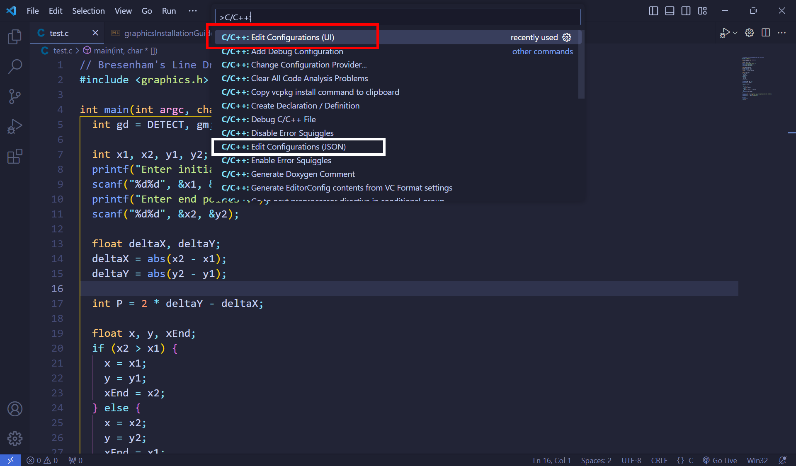

- "<strong>Compiler Path</strong>" should be directed automatically at gcc.exe for C codes

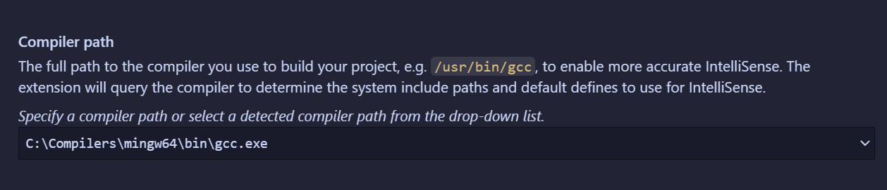

- "<strong>C standard</strong>" should also be automatically set at "<strong>c17</strong>" and leave "<strong>C++ standard</strong>" as it is, since we won't be using c++ for this (or change it to "<strong>c++20</strong>") - this is just to use latest compatible C/C++ code standards

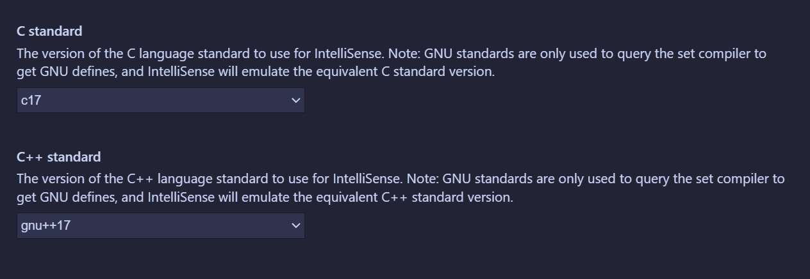

A new folder is automatically created in main folder named "<strong>.vscode</strong>". We will use this folder to use as a template for OTHER graphics C programs without having to set up vs code again and again !!!

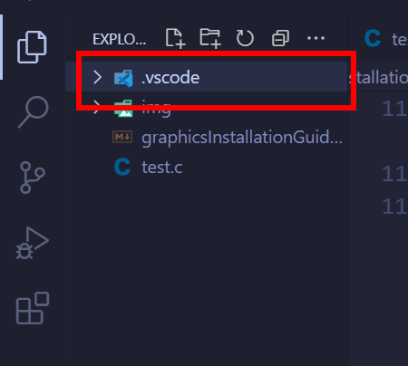

- now click/hover over "<strong>Terminal</strong>" then click on "<strong>Configure Tasks...</strong>" (in my case due to screen size being smaller, that menu was hidden behind dots)

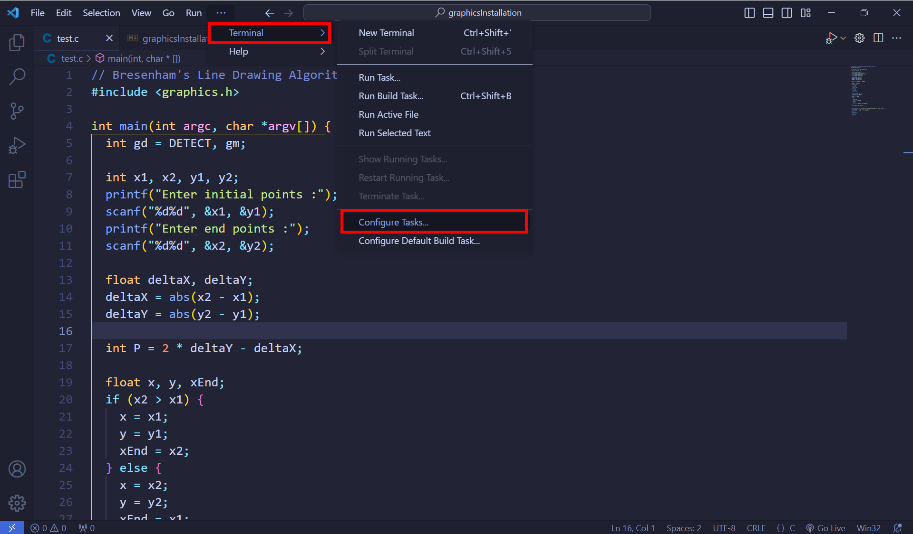
    
- all avaiable c compiler options should come up (in my case Clang and GCC as I downloaded one with both present)
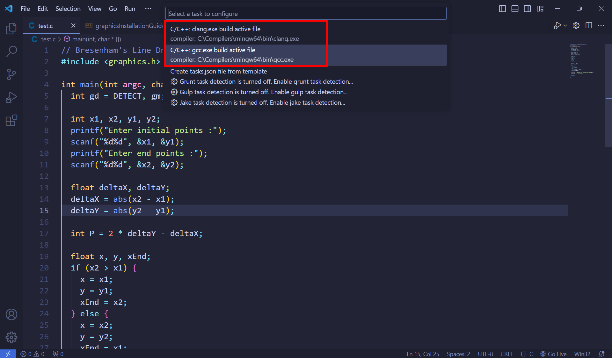

- click on either one of those (while c code tab is active), it creates and opens "tasks.json" inside of that ".vscode" folder. This is where we can properly link libraries to compile our graphics program in C code

- if you want to use another compiler for eg, Clang, simply follow previous steps and click on Clang

- next, inside "tasks.json" add these lines inside "<strong>args</strong>":

  - "-std=c17",
  - "-lmingw32",
  - "-LC:/mingw64/bin", //linker file path
  - "-lSDL_bgi", //SDL_bgi linker
  - "-lSDL2main", //SDL2 linker
  - "-lSDL2", //SDL2 linker
  - // "-mwindows" //uncomment in case console input isn't required and only mouse input is used

Don't forget to add commas
  - the "-std=c17" is for using c17 C code standards
  - the "-LC:/mingw64/bin" is for linking our libraries that we extracted in our mingw folder, for me it will be "-LC:/Compilers/mingw64/bin" - just as a reference

These linkers are provided in [SDL_bgi](https://sdl-bgi.sourceforge.io/) !!!

#### Some more vs code configuration

modify the line:
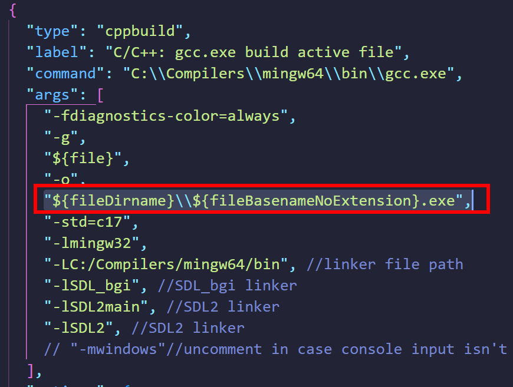
to:
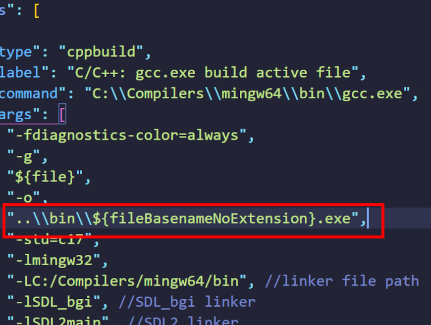

- this keeps all the compiled ".exe" or execuatable files in "bin" folder when C code is compiled without issues. Just make sure said "bin" folder is present in the main folder

### Compiling C graphics code in VS Code

We are almost there to run our graphics C program.
 - Simply press "<strong>Ctrl+Shift+B</strong>" to compile our C code.
 - Run our exe file from bin folder.

 

AND WE ARE DONE, FINALLY !!! 🥳

As to how I ran the exe in vs code terminal, pls check our friendly neighbourhood ~~Spiderman~~ INTERNET to learn USEFULL shortcuts

 - if it results in error like "output file not found smth..." remove or add one dot from the previously modified fileDir line, this is mostly due to path error for that "<strong>bin</strong>" folder
 - if it results in smth header not found, you probably didn't extract the header files in proper location. make sure to properly copy it in said locations
 - if it results in other errors, Internet is your friend
 - LASTLY, check the documentations of both [SDL](https://www.libsdl.org/) and [SDL_bgi](https://sdl-bgi.sourceforge.io/) libraries for more info on how these works.

### Important !!!

- Make sure to include "<strong>graphics.h</strong>" header in your C program

- Make sure that your <strong>main()</strong> function has following parameters:
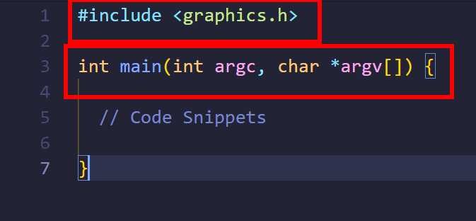
    - if not it will conflict with main() function included in SDL librairies. Check there documentation for more, AGAIN !!!

### Why do all these instead of using graphics.h header file ?

- Simply because graphics.h is old and not updated for modern systems.
- Also BGI was for old DOS era systems.

### Why use graphics.h at all then ?

- Well for college lessons, not more not less. It introduces us to computer graphics in C atleast.

HAPPY CODING !!!
