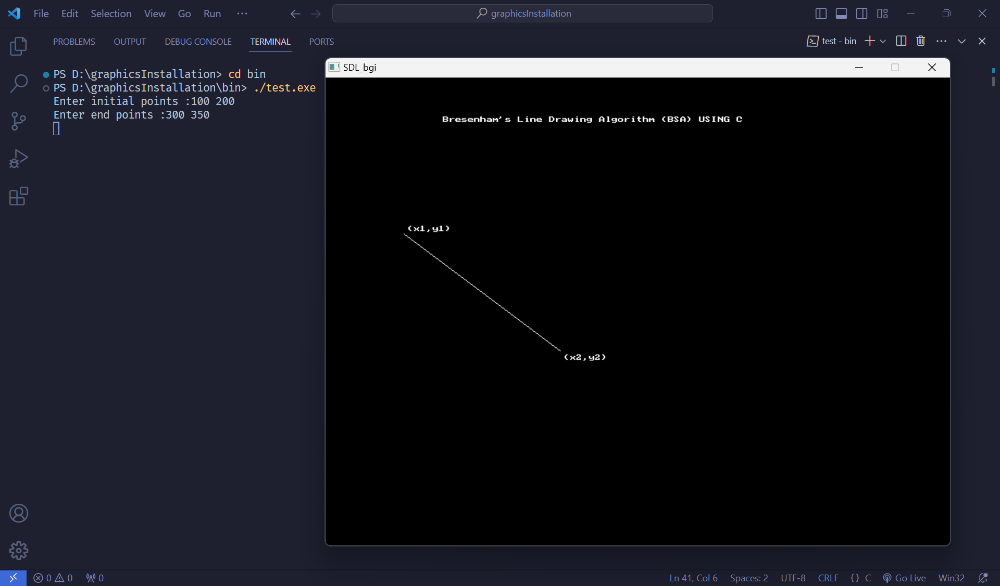

# Modern Graphics Library (with SDL) Installation Guide on C for Windows

## Steps

### Downloads

- Download mingw compiler from: https://winlibs.com/ (also includes clang and others)
  - preferably latest one and 64bit for modern systems

  

  - info on compiler is explained in this page too 😊

- Download SDL (Simple Directmedia Layer) from: https://www.libsdl.org/

  

  - it will direct you to their github page, download **SDL2-devel-2.28.5-mingw.zip** (since we are using windows with mingw compiler) 

  

  - info on what SDL is and all, is provided in their own documentations

- Download SDL_bgi from: https://sdl-bgi.sourceforge.io/
  - this project brings functionality of above SDL libraries with BGI (Borland Graphics Interface) on modern systems

  

  - download binaries for windows (since we are on windows and using mingw compiler)
  - it will open their sourceforge page and begins downloading automatically

### Installations

- when you download all files it will be like this in your **default** Downloads folder (minus the assignment and index docs file 😅) (for me, it's regular ol' downloads folder)

  

- extract **mingw64** from file named: **winlibs-x86_64-posix-seh-gcc-13.2.0-llvm-17.0.5-mingw-w64ucrt-11.0.1-r3.zip**

  - (I am using **Nanazip** to extract file. You can freely use your own preferred file manager of your choice 😊)

  


  - extract preferably on location such as "**C:\mingw**"

  

  - in my case it's inside "**Compilers**" folder inside of "**C:**" drive, so it is "**C:\Compilers\mingw64**"

- extract **all** folders from inside of **SDL2-devel-2.28.5-mingw.zip => SLD2-2.28.5 => x86_64-w64-mingw32** folders to **C: => mingw64**

  
  - this should copy SDL files inside **mingw64** folder or wherever you extracted that folder to

- extract "**SDL_bgi.dll**" file  inside of **SDL_bgi-3.0.0 => bin => Mingw64** to **C: => ming64 => bin** directory or inside **bin** folder of wherever you extracted **ming64** to

  

- extract/copy "SDL_bgi.h" file from inside of "**SDL_bgi-3.0.0 => src**" to "**C: => mingw64 => include => SDL2**"

  

- similarly, copy "**graphics.h**" from same folder (SDL_bgi-3.0.0\src) to now in include folder (mingw64/include)

  

If you followed these instructions, **Congrats** 👏! All necessary files have been properly installed. But, we still need to configure it so that the compiler knows which libraries are where and link it.

### Configuration

For this I am using VS Code (-- which is the best text editor - for me atleast, pls don't kill me ( •̀ ω •́ )✧ --), you can use whatever text editor you want but I only know how to configure it in vs code. For others, PLEASE check there own documentations.

#### In Windows

- First, lets direct windows to know the location of ming64 compiler
- search for "**Edit System Environment**"


- click on it, it will give uac (user account control) promt, click on "Yes"
- click "**Environment Variables**"
  
  

- "Environment Variables" window should pop up, double click 👆👆 on "path" to open another window "**Edit environment variable**"
- click on "New" or on blank space
- simply copy the "**bin**" path from where you have extracted ming64 to. For me it will be "C:\Compilers\mingw64\bin". For you it may be smth like "**C:\ming64\bin**" and paste it in that blank space !!!


- now click ok, ok and finally... ok 👆👆👆

#### In VS Code

Now let's configure vs code to link SDL and SDL_bgi headers and libraries

- first create a graphicsTemplate folder in any location of your choice
- open that folder using vs code (use cmd or open it directly from vs code)
- create a new file, name is test.c or anything and save in c.
- copy code from "test.c" and paste it in YOUR test.c and save it

- now install this extension: [C/C++](https://marketplace.visualstudio.com/items?itemName=ms-vscode.cpptools) (for intellisense and others)

- then, press "**Ctrl+Shift+P**" to open search box and type "**C/C++**", click on "**C/C++: Edit Configurations(UI)**" not the one with **(JSON)**


- "**Compiler Path**" should be directed automatically at gcc.exe for C codes


- "**C standard**" should also be automatically set at "**c17**" and leave "**C++ standard**" as it is, since we won't be using c++ for this (or change it to "**c++20**") - this is just to use latest compatible C/C++ code standards


A new folder is automatically created in main folder named "**.vscode**". We will use this folder to use as a template for OTHER graphics C programs without having to set up vs code again and again !!!


- now click/hover over "**Terminal**" then click on "**Configure Tasks...**" (in my case due to screen size being smaller, that menu was hidden behind dots)


    
- all avaiable c compiler options should come up (in my case Clang and GCC as I downloaded one with both present)


- click on either one of those (while c code tab is active), it creates and opens "tasks.json" inside of that ".vscode" folder. This is where we can properly link libraries to compile our graphics program in C code

- if you want to use another compiler for eg, Clang, simply follow previous steps and click on Clang

- next, inside "tasks.json" add these lines inside "**args**":
```json
  "-std=c17",
  "-lmingw32",
  "-LC:/mingw64/bin", //linker file path
  "-lSDL_bgi", //SDL_bgi linker
  "-lSDL2main", //SDL2 linker
  "-lSDL2", //SDL2 linker
  // "-mwindows" //uncomment in case console input isn't required and only mouse input is used
```

Don't forget to add commas
  - the "-std=c17" is for using c17 C code standards
  - the "-LC:/mingw64/bin" is for linking our libraries that we extracted in our mingw folder, for me it will be "-LC:/Compilers/mingw64/bin" - just as a reference

These linkers are provided in [SDL_bgi](https://sdl-bgi.sourceforge.io/) !!!

#### Some more vs code configuration

modify the line:

to:


- this keeps all the compiled ".exe" or execuatable files in "bin" folder when C code is compiled without issues. Just make sure said "bin" folder is present in the main folder

### Compiling C graphics code in VS Code

We are almost there to run our graphics C program.
 - Simply press "**Ctrl+Shift+B**" to compile our C code.
 - Run our exe file from bin folder.

 

AND WE ARE DONE, FINALLY !!! 🥳

As to how I ran the exe in vs code terminal, pls check our friendly neighbourhood ~~Spiderman~~ INTERNET to learn USEFULL shortcuts

 - if it results in error like "output file not found smth..." remove or add one dot from the previously modified fileDir line, this is mostly due to path error for that "**bin**" folder
 - if it results in smth header not found, you probably didn't extract the header files in proper location. make sure to properly copy it in said locations
 - if it results in other errors, Internet is your friend
 - LASTLY, check the documentations of both [SDL](https://www.libsdl.org/) and [SDL_bgi](https://sdl-bgi.sourceforge.io/using.html) libraries for more info on how these works.

### Note
- "if you release your compiled program, you must also provide **SDL2.dll** and **SDL_bgi.dll** in the same directory." - [source](https://sdl-bgi.sourceforge.io/howto_CodeBlocks.html) from official site, just in case if the file doesn't run
- this is likely because our .exe file is dependent on .dll files and first priority take to search for said dll files is the location of our exe and then to windows. [source](https://stackoverflow.com/questions/64396979/how-do-i-use-sdl2-in-my-programs-correctly)
- since we are using external dll namely SDL2.dll and SDL_bgi.dll, its just best to simply copy it in our exe folder everytime, unless there's a method to automatically do so in VS Code. If I find it, I will update it later
- both of these can be found inside **"C: => mingw64 => bin"**, i.e. if you have correctly installed/extracted required files

- want to know what dll is ? Ans: Internet my friend

### Important !!!

- Make sure to include "**graphics.h**" header in your C program

- Make sure that your **main()** function has following parameters: **(int argc, char *argv[])**

  ```c
  int main(int argc, char *argv[]){
    /* Code Segments */
  }
  ```
  


- if not it will conflict with main() function included in SDL librairies. Check there documentation for more, [AGAIN](https://wiki.libsdl.org/SDL2/FrontPage)!!!

### Why do all these instead of using graphics.h header file ?

- Simply because graphics.h is old and not updated for modern systems.
- Also BGI was for old DOS era systems.

### Why use graphics.h at all then ?

- Well for college lessons, not more not less. It introduces us to computer graphics in C atleast.

HAPPY CODING !!!

Also, check my "How to configure modern graphics in C for Linux/WSL", [here](https://github.com/DadeGamerNoob/graphicsInstallationInLinuxForC)!!!
